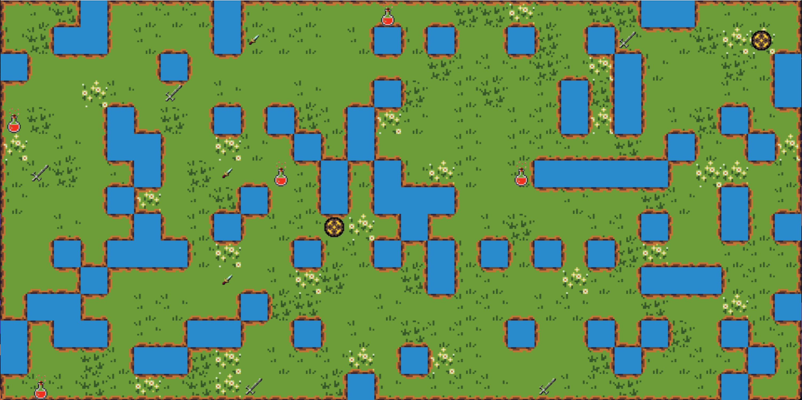

# RPG-GPT Language Model Game - README (Draft)

Welcome to the RPG Style Game, where large language models come to life to make decisions and actions within the game! In this thrilling adventure, you'll step into a world of goblins, heroes, and magical encounters. You, as a human player, will be able to prompt the language model occasionally to make certain decisions, but be aware that direct interaction with the model during critical moments is restricted to maintain balance and fairness. Your ultimate goal is to achieve victory by either collecting all the goblin pieces or being the last man standing.

## Table of Contents
- [RPG-GPT Language Model Game - README (Draft)](#rpg-gpt-language-model-game---readme-draft)
  - [Table of Contents](#table-of-contents)
  - [Introduction](#introduction)
  - [Getting Started](#getting-started)
    - [System Requirements](#system-requirements)
    - [Installation](#installation)
  - [Gameplay](#gameplay)
    - [Interacting with the Language Model](#interacting-with-the-language-model)
    - [Winning Conditions](#winning-conditions)
  - [Tips and Strategies](#tips-and-strategies)
  - [Contributing](#contributing)

## Introduction
In this RPG Style Game, you'll embark on a thrilling journey in a fantasy world filled with goblins, treasures, and magical encounters. The unique twist lies in the involvement of large language models that will make various decisions and actions based on your prompts. You, as a human player, can guide the game's direction and influence outcomes, but be mindful that direct access to the model during crucial moments is restricted for a fair and challenging experience.

## Getting Started

### System Requirements
Before diving into the game, ensure your system meets the following requirements:
- Operating System: Windows 10, macOS, or Linux
- RAM: 8GB or higher
- Disk Space: 2GB or higher
- Internet Connection: Required to interact with the language model

### Installation
To start playing the RPG Style Game, follow these simple steps:
1. Download the game client from our official website.
2. Install the game on your computer by following the on-screen instructions.
3. Launch the game and create your unique player profile.

## Gameplay
The RPG Style Game combines traditional RPG elements with the excitement of a large language model making decisions. As you explore the fantastical world, you can occasionally prompt the language model to make certain decisions, but direct access during key moments is blocked for everyone's fair play.

### Interacting with the Language Model
During your adventure, you can interact with the language model by using predetermined prompts. Type your prompt in the chatbox and watch as the model generates responses and actions based on your input. Be creative with your prompts, as the more detailed and imaginative you are, the richer the game experience will be!

### Winning Conditions
The game offers three paths to victory:

1. **Collect All Goblin Pieces**: Unravel the mystery of the goblin pieces scattered across the world. To win, you must find and collect all the pieces before your rivals do.

2. **Be the Last Man Standing**: Engage in battles, strategize, and outwit your opponents. If you defeat all other players and remain the last surviving hero, victory is yours.

3. **Bigg Boss Challenge**: Confront the formidable Bigg Boss, a menacing goblin overlord. Defeat him in an epic showdown to claim victory and glory.

Remember, each path presents unique challenges and requires different approaches. Choose your strategy wisely and embrace the adventure!

## Tips and Strategies
- **Explore Thoroughly**: To find all the goblin pieces and hidden treasures, explore every nook and cranny of the world. Who knows what secrets lie in wait?

- **Form Alliances**: While direct interaction with the model during battles is blocked, forming alliances with other players can be advantageous. Team up, share information, and coordinate strategies to increase your chances of success.

- **Strategic Prompts**: When interacting with the language model, think strategically. Your prompts can influence the model's decisions, so craft them carefully to gain the upper hand.

<!-- ## Troubleshooting
Encountering any issues or bugs during your adventure? Visit our official website or community forums for troubleshooting guides and support from our dedicated team. -->

## Contributing
We appreciate contributions from the gaming community! If you have ideas for improvements or want to report issues, please check our guidelines for contributing on our official website.
